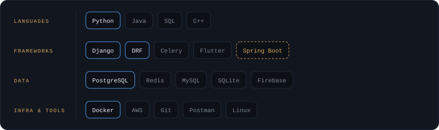
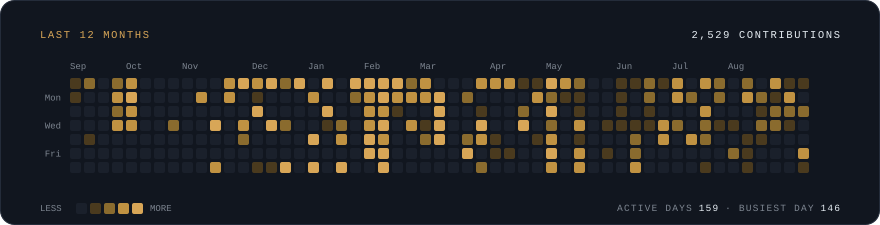

<div align="center">

<picture>
  <source media="(prefers-color-scheme: dark)" srcset="assets/header-dark.svg">
  <source media="(prefers-color-scheme: light)" srcset="assets/header-light.svg">
  
</picture>

<br>

<a href="https://www.linkedin.com/in/mohammed-hafeez-574306235"></a>
<a href="https://twitter.com/mohamedhafeez0"></a>
<a href="mailto:mohammedhafeez.dev@gmail.com"></a>
<a href="https://pypi.org/project/velox-framework/"></a>


</div>

---

I build backend systems in Python — REST APIs, async services, and the developer tooling
around them. Two of my libraries are published on **PyPI**. Lately I've been going deeper
into Spring Boot and distributed system design.

```console
$ pip install velox-framework django-asyncdocs
```

<br>

## Stack

<picture>
  <source media="(prefers-color-scheme: dark)" srcset="assets/stack-dark.svg">
  <source media="(prefers-color-scheme: light)" srcset="assets/stack-light.svg">
  
</picture>

<sub>

**Blue** = what I reach for daily · **Grey** = comfortable with · **Dashed** = currently learning

</sub>

<br>

## Selected work

| Project | What it does | Built with |
| :--- | :--- | :--- |
| **[velox&#8209;framework](https://github.com/MUHAMMEDHAFEEZ/velox-framework)**<br><sub>`pip install velox-framework`</sub> | An async-first Python backend framework — takes what I like from Django, FastAPI and Laravel and keeps the architecture clean. | [](https://pypi.org/project/velox-framework/)<br>`Python 3.12+` |
| **[django&#8209;asyncdocs](https://github.com/MUHAMMEDHAFEEZ/django-asyncdocs)**<br><sub>`pip install django-asyncdocs`</sub> | AsyncAPI documentation for Django — *"Swagger for everything Swagger doesn't cover."* | [](https://pypi.org/project/django-asyncdocs/)<br>`Django 4.2+` |
| **[SkillTok](https://github.com/MUHAMMEDHAFEEZ/SkillTok)** | A TikTok-style learning platform where AI splits courses into short lessons and the feed adapts to how you watch. | `Django` `DRF` `Celery` `Flutter` |
| **[vaultkeep](https://github.com/MUHAMMEDHAFEEZ/vaultkeep)** | Passwords, SSH keys and secrets — encrypted, stored locally, and actually yours. | `Electron` `React` `TypeScript` |
| **[iphone&#8209;mirror&#8209;linux](https://github.com/MUHAMMEDHAFEEZ/iphone-mirror-linux)** | Mirrors an iPhone screen to Linux in real time. No cloud, no accounts. | `Python` |
| **[zipai-cli](https://github.com/MUHAMMEDHAFEEZ/zipai-cli)** | A token-efficient AI CLI that encodes context in a compact DOT format and enforces a budget. | `Node.js` |

<details>
<summary><b>More things I've built</b></summary>

<br>

| Project | What it does | Built with |
| :--- | :--- | :--- |
| [Grow-Backend](https://github.com/MUHAMMEDHAFEEZ/Grow-Backend) | Backend service for the Grow platform. | `Python` |
| [Sitelaps-backend](https://github.com/MUHAMMEDHAFEEZ/Sitelaps-backend) | API behind [Sitelaps](https://github.com/MUHAMMEDHAFEEZ/Sitelaps). | `Python` |
| [TLN-API](https://github.com/MUHAMMEDHAFEEZ/TLN-API) | REST API for The Light Network — [live docs](https://thelightnetworkmea.cloud/api/v1/docs/). | `Python` |
| [OpenWA-TLN](https://github.com/MUHAMMEDHAFEEZ/OpenWA-TLN) | WhatsApp integration service. | `TypeScript` |
| [IMG-CONVert](https://github.com/MUHAMMEDHAFEEZ/IMG-CONVert) | Browser-based image format converter. | `HTML` |
| [ROV_CONTROL_GUI](https://github.com/MUHAMMEDHAFEEZ/ROV_CONTROL_GUI) | Desktop control interface for an underwater ROV. | `Python` |

</details>

<br>

## Activity

<picture>
  <source media="(prefers-color-scheme: dark)" srcset="assets/activity-dark.svg">
  <source media="(prefers-color-scheme: light)" srcset="assets/activity-light.svg">
  
</picture>

<br>

## Reach me

Open to backend work and collaboration — **[mohammedhafeez.dev@gmail.com](mailto:mohammedhafeez.dev@gmail.com)**

<br>

<div align="center">
<picture>
  <source media="(prefers-color-scheme: dark)" srcset="https://github.com/user-attachments/assets/916aad76-a56d-4e72-a2de-5f70d5ecde93">
  <source media="(prefers-color-scheme: light)" srcset="https://github.com/user-attachments/assets/1ba2bd51-f9b2-4080-b48b-7f6dd9845336">
  
</picture>
</div>
